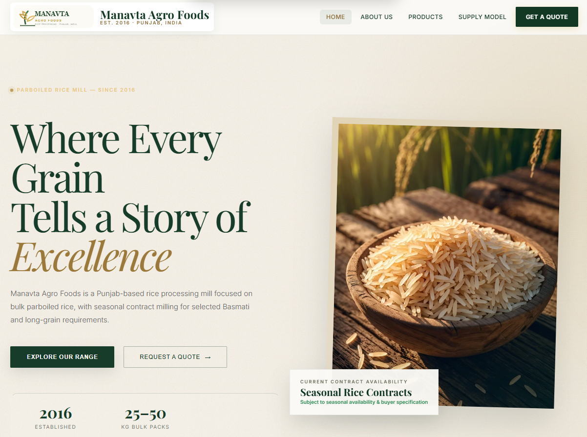

<div align="center">

# 🌾 Manavta Agro Foods

### Quality Rice. Trusted Processing. Since 2016.

A modern full-stack business website for Manavta Agro Foods, a parboiled rice mill based in Punjab, India.

<br/>

<a href="https://manavta-agro-foods.vercel.app/">
  
</a>
<a href="https://github.com/shubhneet-garg/manavta-agro-foods">
  
</a>

<br/><br/>


</div>

---

## 📸 Website Snapshot

<div align="center">



*Manavta Agro Foods — Website Preview*

</div>

---

## 📖 About the Project

**Manavta Agro Foods** is a full-stack digital platform developed for a rice milling business established in 2016 in Punjab, India.

The platform presents the company's rice products, processing capabilities, business information, and customer enquiry workflows through a responsive website.

The project combines a React-based frontend with a Node.js and Express backend, MongoDB data storage, and administrative functionality.

### Business Information

| Detail | Information |
|---|---|
| Company | Manavta Agro Foods |
| Established | 2016 |
| Industry | Rice Milling & Agro Processing |
| Location | Rureke Kalan, Barnala, Punjab, India |
| Primary Business | Parboiled Rice Mill |
| Packaging | 25–50 kg bulk packs |
| Email | manavtaagrofood@gmail.com |

---

## ✨ Key Features

### Customer Website
- Responsive business website
- Product catalogue and rice variety listings
- Product search and discovery
- Business and processing information
- Quote request workflow
- Sample request workflow
- Customer account and portal interfaces
- Privacy policy, shipping policy and terms pages

### Backend & API
- REST API architecture
- MongoDB data persistence
- Product and category management
- Enquiry management
- Authentication and authorization
- Input validation
- Centralized error handling
- Persistent idempotency support
- Audit logging
- Email notification workflows

### Engineering
- Modular backend structure
- Environment-based configuration
- Security middleware
- API documentation
- Automated test files
- Deployment and operational documentation
- Performance and smoke-test scripts

---

## 🛠️ Technology Stack

| Layer | Technologies |
|---|---|
| Frontend | React, JavaScript, CSS |
| Build Tool | Vite |
| Backend | Node.js, Express.js |
| Database | MongoDB, Mongoose |
| Authentication | JWT |
| API | REST |
| Deployment | Vercel / Node.js hosting |
| Version Control | Git, GitHub |

---

## 🏗️ Project Architecture

```text
manavta-agro-foods/
│
├── backend/
│   ├── src/
│   │   ├── config/
│   │   ├── controllers/
│   │   ├── middleware/
│   │   ├── models/
│   │   ├── routes/
│   │   ├── services/
│   │   ├── utils/
│   │   └── validators/
│   ├── scripts/
│   ├── tests/
│   └── package.json
│
├── frontend/
│   ├── images/
│   ├── icons/
│   ├── src/
│   ├── index.html
│   └── manifest.webmanifest
│
├── docs/
│   ├── ADR-001-modular-monolith.md
│   ├── ADR-002-order-consistency.md
│   ├── ADR-003-persistent-idempotency.md
│   ├── openapi.yaml
│   └── ROADMAP_IMPLEMENTATION.md
│
├── ops/
├── scripts/
├── API.md
├── ARCHITECTURE.md
├── DEPLOYMENT.md
├── SECURITY.md
├── TESTING.md
├── package.json
├── vite.config.js
└── vercel.json
```

---

## 🚀 Run Locally

### Prerequisites

- Node.js
- npm
- MongoDB instance
- Git

### 1. Clone the repository

```bash
git clone https://github.com/shubhneet-garg/manavta-agro-foods.git
```

```bash
cd manavta-agro-foods
```

### 2. Install dependencies

```bash
npm install
```

### 3. Configure environment variables

Use the provided `.env.example` as a reference.

Create your local `.env` file and configure the required values:

```env
NODE_ENV=development
PORT=5000
MONGODB_URI=your_mongodb_connection_string
```

Configure the remaining authentication, email, and application variables according to the environment configuration and deployment documentation.

**Never commit real credentials, API keys, JWT secrets, or database passwords.**

### 4. Start the application

```bash
npm run dev
```

Use the scripts defined in the root and individual package files if your local setup requires separate frontend and backend processes.

---

## 📚 Documentation

| Document | Description |
|---|---|
| [API Documentation](API.md) | API endpoints and usage |
| [Architecture](ARCHITECTURE.md) | Application structure |
| [System Design](SYSTEM_DESIGN.md) | Design overview |
| [Deployment Guide](DEPLOYMENT.md) | Deployment configuration |
| [Security](SECURITY.md) | Security considerations |
| [Testing](TESTING.md) | Testing instructions |
| [Production Handoff](PRODUCTION_HANDOFF.md) | Deployment handoff and operational notes |

---

## 🔐 Security

Security considerations implemented in the project include:

- Environment-based secrets
- Authentication middleware
- Request validation
- Centralized error handling
- Idempotency handling
- Audit logging
- Security-related middleware

Production security and deployment configuration should be independently verified before handling real customer information.

---

## 🌐 Live Deployment

<div align="center">

### Explore Manavta Agro Foods

<a href="https://YOUR-VERCEL-URL.vercel.app">
  
</a>

</div>

---

## 👨‍💻 Developer

<div align="center">

### Shubhneet Garg

B.Tech Computer Science Engineering  
Full Stack Developer | React.js | Node.js | MongoDB

<a href="https://github.com/shubhneet-garg">
  
</a>

<a href="https://www.linkedin.com/in/shubhneet-garg/">
  
</a>

</div>

---

<div align="center">

**Built with React, Node.js and MongoDB.**

*Manavta Agro Foods · Punjab, India · Est. 2016*

</div>
